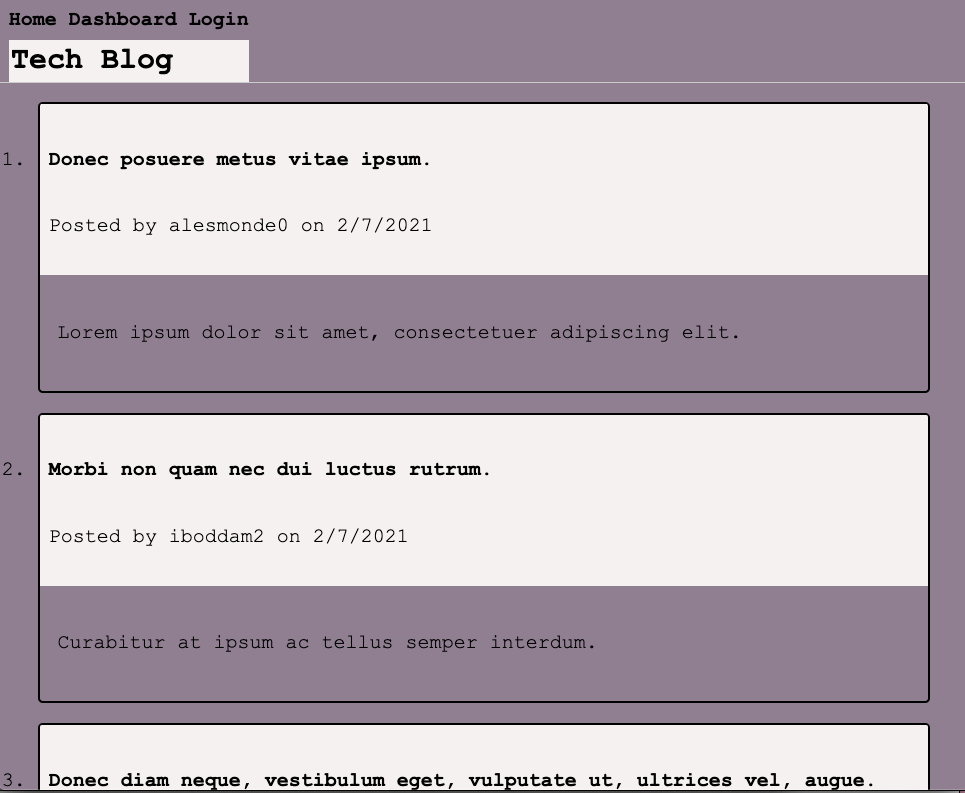

# Model-View-Controller-Tech-Blog

# Installation
[Github] (https://github.com/wdavonta/Model-View-Controller-Tech-Blog)
"MVC Tech Blog"

[Heroku] (https://mighty-brook-18820.herokuapp.com/)

# About the Project
CMS-style blog site to be able to publish articles, blog posts, and thoughts and opinions. While making the data base with MVC paradigm.

# Usage
- npm start
- npm run seed
- sequelize
- mysql

# Contact Info
Da'Vonta Williamson
If you have any questions just send me an email and I will respond back soon as i can.
E: <a href="mailto:wdavonta@gmail.com">wdavonta@gmail.com</a>
                </address>